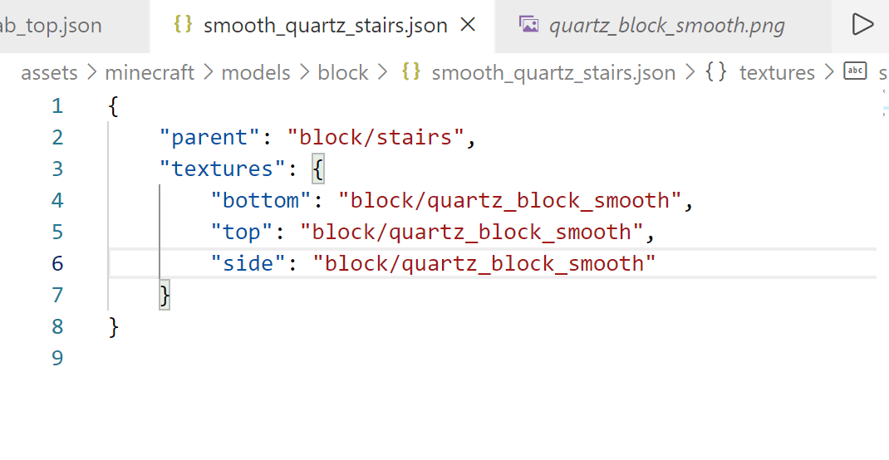
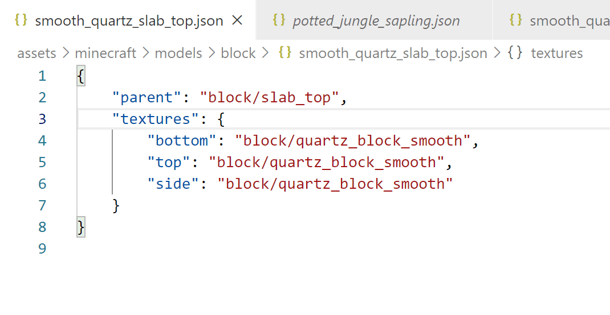

# Minecraft Resourcepack Helper

To help minecraft developers create resource packs more efficiently
**Only support namespace "minecraft", and other namespaces may be suppoted later**

## Features

- Goto Definitions (also support CIT)
- Json Validator
- Creating New Pack by Command
- Highlight for Variables in Model Files

## Install

You can install it from the [VSCode Marketplace](https://marketplace.visualstudio.com/items?itemName=stone926.minecraft-resourcepack-helper)

## Goto Definitions

You can goto the definitions of textures and models in the workspace by `Ctrl-clicking` on their names.

## Validator

It can help you verify the validity of the JSON file and display error messages and suggestions.

## Repository
[https://gitee.com/stone926/minecraft-resourcepack-helper](https://gitee.com/stone926/minecraft-resourcepack-helper)

**Enjoy!**