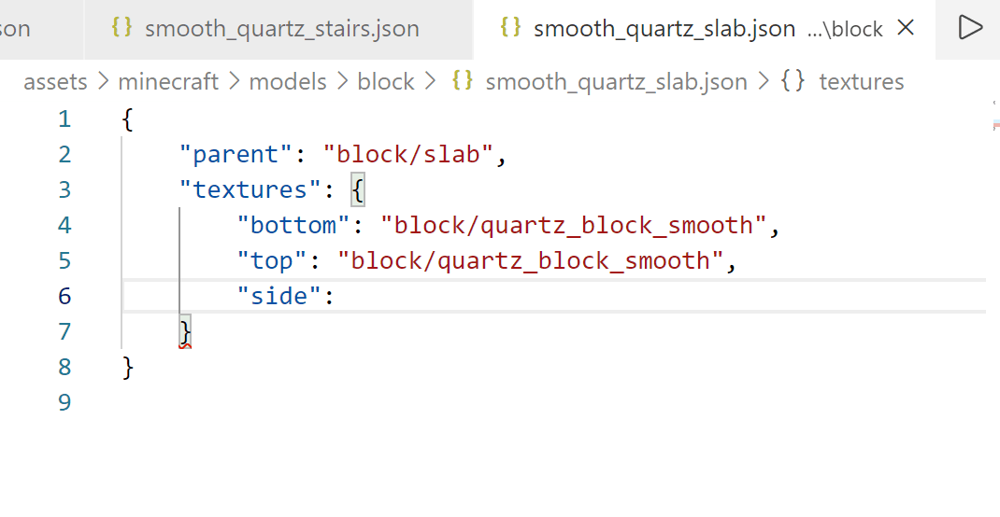
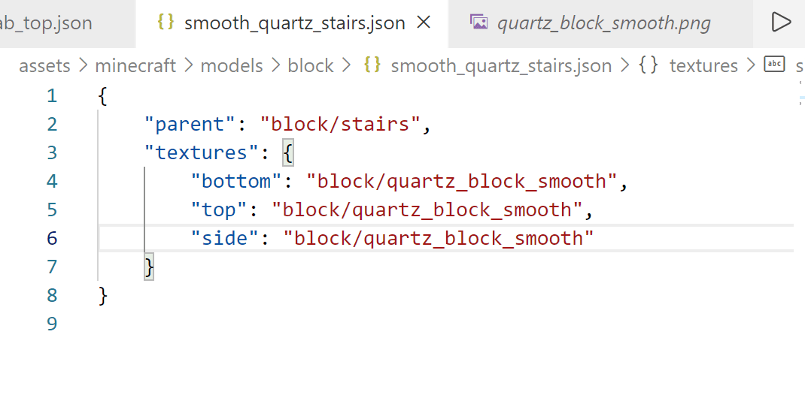
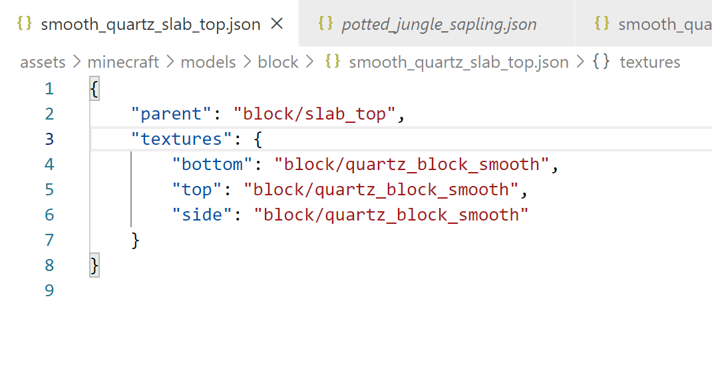

# Minecraft 资源包助手

[English README](README.md)

Minecraft 资源包助手是面向 Minecraft Java 版资源包作者的 VS Code 扩展。它理解现代资源包结构，在编辑时提供资源路径跳转、补全、诊断、JSON 校验、模型预览和引用关系视图。

## 预览







## 功能亮点

- 为方块状态、方块/物品模型、现代物品模型定义、粒子、纹理图集、装备、字体、路径点样式、后处理、声音和着色器导入提供跳转定义和资源路径补全。
- 为 CIT `.properties` 中的纹理和模型路径，以及 `citresewn/` 下的 CIT 模型 JSON 文件，提供跳转定义、补全、缺失资源诊断和资源关系图支持。
- 缺失资源诊断会按当前资源包、资源包 overlays 和 filters、配置的低优先级资源包、原版资源逐级解析。
- 模型纹理变量支持：跳转到 `#texture` 定义、追踪父模型继承的变量、高亮未定义变量，并提示循环变量引用或过深的父模型链。
- Minecraft 资源活动栏视图展示当前文件引用、入站引用、模型继承、子模型，以及方块状态 -> 模型 -> 纹理关系。
- 为模型 JSON 提供 Three.js 模型预览，支持纹理/实体/线框显示模式、相机视角、透视/正交相机、网格与坐标轴开关、问题/依赖面板、实时刷新和 PNG 导出。
- 为支持的资源包文件提供 JSON Schema 校验，包括资源包元数据、模型、物品定义、粒子、纹理图集、装备、字体、声音、语言文件、credits、GPU 警告列表、区域合规文件和 PNG 纹理元数据。
- 额外语义检查覆盖 `pack.mcmeta`、`pack.png`、colormap PNG 尺寸、`sounds.json`、后处理 target、模型 parent/纹理变量链，以及 `assets/<namespace>/texts/{splashes,end,postcredits}.txt`。
- 扩展命令、运行时提示、诊断、资源关系图标签、模型预览问题和模型预览 webview 控件均覆盖英文与简体中文本地化。
- 提供创建现代资源包脚手架的命令，包含常用命名空间目录、默认 `pack.png` 和 `min_format`/`max_format` 资源包元数据。
- 内置按需加载的 RSGL 语言能力与构建命令；生成资源与手写资源共用同一工程上下文、跳转、诊断和资源关系图。

## 快速开始

1. 从 [VS Code 扩展市场](https://marketplace.visualstudio.com/items?itemName=stone926.minecraft-resourcepack-helper) 安装扩展。
2. 打开包含 Minecraft 资源包 `pack.mcmeta` 的文件夹。
3. 如需让跳转、补全、诊断、资源关系图和模型预览回退到原版资源，配置 `McResHelper.vanillaResourcePackPath`。
4. 可选：用 `McResHelper.customResourcePackPaths` 配置低优先级资源包根目录的绝对路径。
5. 打开受支持的资源包文件，使用跳转定义、路径建议、诊断、Minecraft 资源活动栏视图，或在模型 JSON 中打开模型预览。

资源包或 `.rsgl` 文档会激活扩展。在只编辑 JSON 的工作流中，RSGL 运行时代码、语言服务器进程、源码 watcher 和构建 worker 会保持未加载，直到真实 RSGL 信号需要它们。

## 资源解析顺序

跳转、补全、诊断、资源关系图和模型预览会尽量使用同一套加载顺序：

1. 当前正在编辑的 local 资源包。对于 RSGL 工程，它是由 `rsgl.config.json.outDir` 或资源包发现确定的 canonical output pack root。
2. `pack.mcmeta` 中声明的启用 overlay 和 filter 规则。
3. `rsgl.config.json.customResourcePackPaths` 或 `McResHelper.customResourcePackPaths` 中配置的 custom 低优先级资源包，按高优先级到低优先级排序。
4. `rsgl.config.json.vanillaResourcePackPath` 或 `McResHelper.vanillaResourcePackPath` 指向的 vanilla 资源。

已有配置仍可使用已弃用的 `resourcePackRoots`、`defaultAssetsPath`、`McResHelper.resourcePackLoadOrder` 和 `McResHelper.defaultMcAssetsPath` 兼容别名；新配置应使用上述 canonical 名称。

物理文件和 live RSGL producer 通过同一个工程上下文解析。因此 JSON、shader、CIT 或 RSGL 对同一个 external/default 资源 ID 会选择相同的 effective local/custom/vanilla layer；归档形式的 custom 资源包和 vanilla jar 始终只读。

## 模型预览

在模型 JSON 编辑器中，可以通过 **McResHelper: 打开模型预览** 命令、编辑器标题/右键菜单，或 Minecraft 资源视图中的模型节点打开预览。

预览会解析父模型、纹理、纹理变量、`.png.mcmeta` 纹理元数据、配置的资源包加载顺序和原版资源。它在 VS Code webview 中渲染方块模型和 generated 物品模型，并在相关模型、纹理、元数据、当前编辑器或配置变化后自动刷新。

预览控件包括：

- 视角预设：3/4、前、后、左、右、顶部和底部。
- 透视相机与正交相机。
- 纹理、实体和线框显示模式。
- 网格和坐标轴显示开关。
- 可点击的问题与依赖列表，用于跳转到相关文件或配置。
- PNG 导出，可自定义宽高，选择透明背景或指定背景色。

当前范围：模型预览支持 Minecraft 模型 JSON 资源和 CIT `.properties` 资源预览。部分视觉效果会使用近似处理，包括无法解码纹理像素时的 generated 物品侧面挤出、动画纹理只显示已加载 PNG 的第一帧，以及元素 rotation `rescale`。

CIT `.properties` 预览是资源预览，不是完整 CIT 运行态模拟。它会尽量解析主 `model` 或 `texture` 并渲染对应模型/纹理，但不会完整执行所有匹配分支或渲染层行为。尤其是 `texture.*`、`tile.*`、`model.*` 状态变体、物品条件匹配、附魔 glint 层、blend 行为以及盔甲/equipment layer 选择，可能与游戏中的 CIT Resewn 结果不同。

## 支持的引用

- `assets/<namespace>/blockstates/**/*.json`：variants 和 multipart 中的模型引用。
- `assets/<namespace>/models/**/*.json`：父模型引用、纹理引用和纹理变量。
- `assets/<namespace>/items/**/*.json`：现代物品模型定义、嵌套模型、特殊模型 base 和受支持的特殊纹理。
- `assets/<namespace>/particles/**/*.json`：粒子纹理引用。
- `assets/<namespace>/atlases/**/*.json`：纹理图集中的纹理和纹理目录引用。
- `assets/<namespace>/equipment/**/*.json`：装备层纹理引用。
- `assets/<namespace>/font/**/*.json`：字体引用，以及 bitmap、TTF、Unihex provider 文件。
- `assets/<namespace>/waypoint_style/**/*.json`：定位栏精灵纹理。
- `assets/<namespace>/post_effect/**/*.json`：后处理着色器引用和 effect 纹理。
- `assets/<namespace>/sounds.json`：声音文件引用和声音事件检查。
- `assets/<namespace>/shaders/{core,post}/**/*.{vsh,fsh}`：`#moj_import` 着色器 include 引用。
- CIT `.properties`：纹理和模型路径跳转、补全、缺失资源诊断和资源关系图支持。
- CIT 模型 JSON：`assets/<namespace>/citresewn/` 下 CitResewn JSON 模型文件的模型和纹理引用。

## 诊断与校验

扩展会把 VS Code JSON Schema 与资源感知诊断结合使用。

- 缺失资源警告使用与跳转和补全相同的解析规则。
- `pack.mcmeta` 检查覆盖现代 `min_format`/`max_format` 用法、旧版 `pack_format`，以及跨越 1.21.8 资源包格式边界的配置。
- 非 JSON 检查覆盖缺失或无效的 `pack.png`、无效或尺寸不正确的 colormap PNG，以及 `splashes.txt`、`end.txt`、`postcredits.txt` 中的 UTF-8 或格式问题。
- `sounds.json` 检查覆盖声音文件引用、声音文件名空白字符、多余 `.ogg` 扩展名、无效数值字段，以及未定义的声音事件引用。
- `post_effect` 检查 target/pass 之间的引用关系。
- 模型检查覆盖 parent 链深度、parent 循环、缺失纹理、缺失纹理变量和纹理变量循环链。

## 资源关系图

**Minecraft 资源**活动栏视图会跟随当前编辑器，展示当前资源周围的引用关系。

- 当前文件：当前资源本身。
- 引用了谁：当前资源指向的模型、纹理、着色器、字体、声音和纹理目录引用。
- 被谁引用：工作区中指向当前资源的入站引用。
- 模型继承树：父模型和子模型。
- 方块：工作区中的方块状态文件，可作为方块状态 -> 模型 -> 纹理链路的入口。
- RSGL producer：live 声明及其物理 materialization，并在适用时标明 current、stale 或 conflict 状态。

该视图合并 physical 与 RSGL 的出站/入站边。物理资源可以跳转到尚未构建的 live RSGL 声明，RSGL 引用也可以跳转到实际生效的 local、custom 或 vanilla 资源。工作区索引会被缓存，也可以通过 **McResHelper: 刷新资源映射** 手动刷新。

## RSGL

RSGL 已直接集成到本扩展，并与 JSON、shader、纹理和 CIT 工具共用同一套资源包工程与解析设置。RSGL runtime 位于延迟加载的独立 host bundle；语言服务器和构建 worker 是仅在需要时启动的隔离进程。

内置 RSGL 支持包括：

- `.rsgl` 语言注册、语法高亮、语言配置、诊断、补全、悬停和格式化。
- RSGL 构建与预览命令，例如 **RSGL: Build Resourcepack JSON**、**RSGL: Preview Build**、**RSGL: Build Source Directory** 和工作区构建命令。
- `rsgl.config.json` 中的工程选项，包括 `root`、`outDir`、Minecraft 目标、外部资源声明、source map 与求值上限；VS Code、语言服务器和 CLI 使用完全一致的工程根与输出目录语义。
- 安全的 build-to-assets transaction：不会覆盖未知手写文件、其他工程输出或已被用户修改的生成文件；只有 ownership manifest 与旧内容 hash 同时匹配时才清理 stale output。
- 物理资源与尚未构建的 live RSGL producer 之间的跨语言跳转。
- 可只读跳转到配置的资源包 ZIP 与原版 `client.jar`；资源使用带 revision 的虚拟 URI，不会解压到工作区。

当前语言仅接受 canonical 语法，包括显式 `model` / `variants` / `multipart` / `choice` 模板方言和 canonical blockstate；同时支持结构化 record 类型与函数值、类型化资源 ID、有界集合操作与 spread、命名空间导入，以及精确的四分之一圈模型几何变换。独立发布的 [RSGL CLI](packages/rsgl-cli/README.md) 为终端工作流提供相同的工程语义。

混合手写/生成资源包可以把源码放在资源包外，同时直接写入真实资源包根：

```text
workspace/
├─ rsgl.config.json
├─ rsgl-src/
│  └─ main.rsgl
└─ pack/
   ├─ pack.mcmeta
   └─ assets/example/...  # 可在这里保留手写资源
```

```json
{
  "root": "rsgl-src",
  "outDir": "pack",
  "namespace": "example"
}
```

`root` 是 RSGL source root。`outDir` 始终是包含 `assets/` 的完整 output pack root，不能直接指向 `assets` 目录，因此不会生成 `assets/assets/...`。checked `extern local` 从该 output pack 中解析手写资源；`custom` 与 `vanilla` 从配置的低层资源中解析。preview 命令会展示 ownership 计划；真实构建把未知文件、其他工程输出或被用户修改的生成文件视为 conflict，在 staging 中提交允许的写入，并且仅在 ownership 与旧内容 hash 都可证明时删除 stale 文件。

## 配置项

- `McResHelper.vanillaResourcePackPath`：原版 Minecraft 资源的绝对路径。可以指向 `assets` 文件夹、`assets/minecraft` 文件夹、包含 `assets/minecraft` 的资源包根目录，或原版 `client.jar`。
- `McResHelper.customResourcePackPaths`：当前编辑资源包下层已启用资源包目录或 ZIP 的绝对路径列表，按高优先级到低优先级排序。解析时会先查当前资源包，再查该列表，最后查原版资源。
- `McResHelper.tipColorForUndefinedTextureVariables`：用于高亮模型文件中未定义 `#texture` 变量的颜色。
- `McResHelper.rsgl.enabled`：`auto` 仅在相关信号出现时加载 RSGL；`on` 在发现工程后预加载 host；`off` 禁用其 runtime、进程、provider 与源码 watcher。静态语法高亮仍可使用。

示例：

```json
{
  "McResHelper.vanillaResourcePackPath": "C:/.minecraft/my_test/26.2/assets/minecraft",
  "McResHelper.customResourcePackPaths": [
    "C:/.minecraft/resourcepacks/base_pack"
  ],
  "McResHelper.rsgl.enabled": "auto",
  "McResHelper.tipColorForUndefinedTextureVariables": "Chartreuse"
}
```

## 命令

- `McResHelper: open folder of vanilla assets`（打开原版资源文件夹）
- `McResHelper: create a new pack in current folder`（在当前文件夹创建新资源包）
- `McResHelper: create a new pack with the current folder as the root directory`（以当前文件夹为根目录创建新资源包）
- `McResHelper: refresh resource graph`（刷新资源映射）
- `McResHelper: open model preview`（打开模型预览）
- `McResHelper: export model preview image`（导出模型预览图片）
- `McResHelper: open model preview from resource graph`（从资源图打开模型预览）
- `McResHelper: create CIT template`（创建 CIT 模板）
- `McResHelper: generate CIT for current item`（为当前物品生成 CIT）

模型预览命令也会出现在模型 JSON 的编辑器菜单中。资源关系图里的模型节点提供内联预览操作。CIT 命令可从命令面板调用；"为当前物品生成 CIT"同时显示在物品纹理和模型的编辑器右键菜单中。

内置 RSGL 命令使用 `RSGL:` 前缀，可构建或预览单文件、源码目录、全部工作区源码根，并刷新工作区资源与诊断。

## 脚手架

资源包创建命令会依次询问资源包名称、命名空间、目标资源包格式版本和描述。生成内容包括 `pack.mcmeta`、默认 `pack.png`，以及 `blockstates`、`models`、`items`、`textures`、`sounds`、`font`、`atlases`、`equipment`、`post_effect`、`shaders`、`waypoint_style` 等常用命名空间目录。

## 开发

```bash
npm install
npm run build
npm run lint
npm test
```

常用专项命令：

```bash
npm run benchmark:model-preview
npm run build:rsgl
npm run watch
npm run package:main:vsix
npm run package:rsgl-cli
```

唯一可安装的 VSIX 包含五个 entry：轻量激活 bundle、延迟 RSGL host、隔离语言服务器、隔离构建 worker 与纯浏览器模型预览。Node 20 CLI 是第六个、位于 VSIX 外的 entry。`npm run watch` 从唯一开发路径增量重建五个 VSIX entry。

公开制品只有两个：组合 VSIX 使用 `vX.Y.Z`，npm CLI 使用 `rsgl-cli-vX.Y.Z`。使用 `npm run release:main` 或 `npm run release:rsgl-cli`；每次只推进所选制品的 manifest、changelog、artifact 和 tag。

发布脚本会原子推送当前分支和唯一的目标 tag，并只对网络传输错误进行有限重试。若远端连接在本地 release commit/tag 创建后仍失败，且该 tag 仍精确指向 HEAD，请使用 `node scripts/release.mjs <main|rsgl-cli> current --resume` 恢复；不要只手动推送分支，否则 tag workflow 不会启动。

## 链接

- [VS Code 扩展市场](https://marketplace.visualstudio.com/items?itemName=stone926.minecraft-resourcepack-helper)
- [RSGL CLI](packages/rsgl-cli/README.md)
- [项目仓库](https://github.com/stone926/minecraft-resourcepack-helper)
